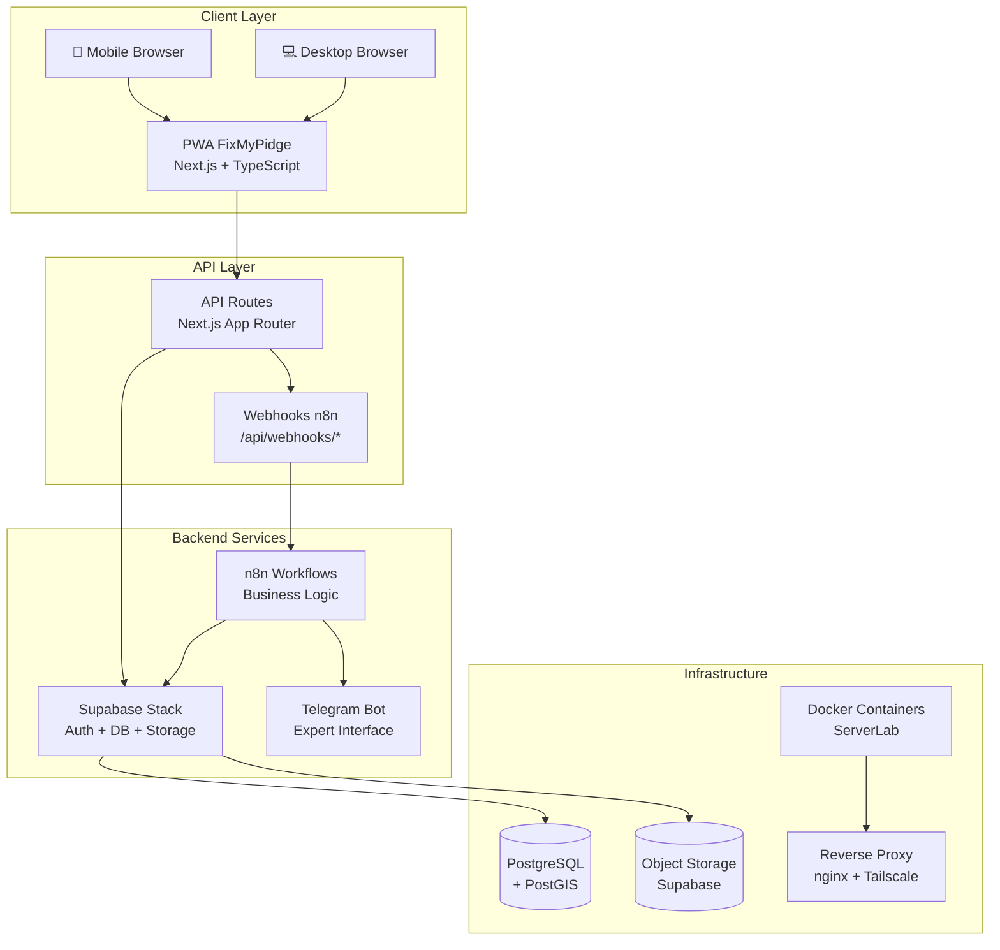
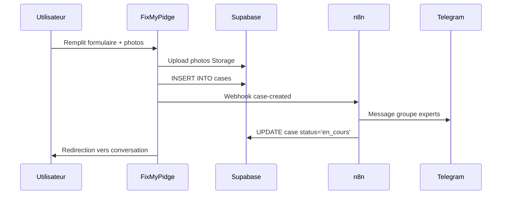
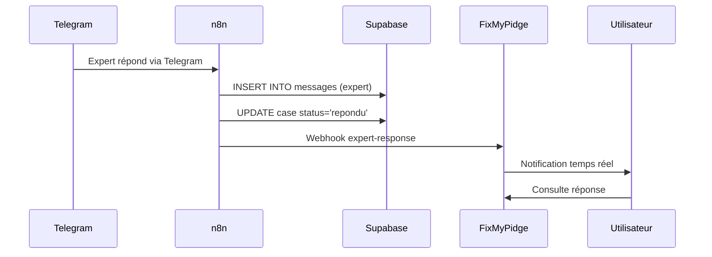

# 🏗️ Architecture technique FixMyPidge

## Vue d'ensemble

FixMyPidge est une application PWA (Progressive Web App) construite avec une architecture moderne et scalable, intégrée dans l'écosystème ServerLab pour une flexibilité maximale des workflows métier.

## 🎯 Principes architecturaux

### Separation of Concerns
- **Frontend** : Interface utilisateur et logique de présentation
- **Backend** : Supabase BaaS pour données et authentification  
- **Workflow** : n8n pour logique métier et intégrations
- **Infrastructure** : ServerLab pour hébergement et services partagés

### Flexibilité métier
- **Workflow agile** : Modifications métier via n8n sans redéploiement
- **API-first** : Interfaces standardisées pour intégrations futures
- **Services partagés** : Réutilisation infrastructure ServerLab

## 🔄 Architecture générale



## 🏠 Stack technique détaillé

### Frontend (Client)
```typescript
// Technologies principales
- Next.js 15 (App Router) : Framework React avec SSR/SSG
- TypeScript 5 : Typage statique et IntelliSense
- Tailwind CSS : Utility-first CSS framework
- PWA : Service Worker + Manifest pour installation native

// État et données
- Zustand : State management léger et performant
- Supabase JS Client : Accès temps réel aux données
- React Hooks : Logique composants moderne

// UI/UX
- Headless UI : Composants accessibles
- Heroicons : Icônes consistantes
- Responsive Design : Mobile-first approach
```

### Backend (API)
```typescript
// API Layer
- Next.js API Routes : Endpoints RESTful
- Webhook Handlers : Intégration bidirectionnelle n8n
- Middleware : Authentification et validation

// Base de données
- Supabase : Backend-as-a-Service complet
- PostgreSQL 16 : Base de données relationnelle
- PostGIS : Extension géospatiale pour localisation
- Row Level Security : Isolation données utilisateur

// Authentification
- Supabase Auth : JWT + Sessions
- Email confirmation : Workflow inscription sécurisé
- Password recovery : Réinitialisation automatique
```

### Workflow Engine
```yaml
# n8n Configuration
Workflows:
  - case_created: Signalement → Notification Telegram
  - expert_response: Telegram → Message utilisateur  
  - status_updates: Changements état automatiques
  - notifications: Email/Push selon préférences

Intégrations:
  - Telegram Bot API : Communication experts
  - Supabase Database : CRUD operations
  - Email SMTP : Notifications utilisateur
  - Webhook Endpoints : Sync bidirectionelle
```

## 🗄️ Architecture des données

### Modèle relationnel
```sql
-- Authentification (géré par Supabase)
auth.users (
  id UUID PRIMARY KEY,
  email TEXT UNIQUE,
  created_at TIMESTAMPTZ
)

-- Signalements principaux
public.cases (
  id UUID PRIMARY KEY,
  user_id UUID → auth.users(id),
  title TEXT NOT NULL,
  description TEXT,
  location GEOGRAPHY(POINT), -- PostGIS
  address TEXT,
  status case_status DEFAULT 'nouveau',
  category case_category,
  created_at TIMESTAMPTZ,
  updated_at TIMESTAMPTZ
)

-- Conversations avec experts
public.messages (
  id UUID PRIMARY KEY,
  case_id UUID → cases(id),
  content TEXT NOT NULL,
  sender_type sender_type, -- 'user' | 'expert'
  sender_id TEXT,
  created_at TIMESTAMPTZ
)

-- Photos attachées
public.case_photos (
  id UUID PRIMARY KEY,
  case_id UUID → cases(id),
  message_id UUID → messages(id), -- Optionnel
  photo_url TEXT NOT NULL,
  created_at TIMESTAMPTZ
)
```

### Types et enums
```typescript
// Statuts des signalements
type CaseStatus = 
  | 'nouveau'     // Signalement créé, en attente
  | 'en_cours'    // Pris en charge par expert
  | 'repondu'     // Expert a fourni des conseils
  | 'resolu'      // Situation résolue avec succès
  | 'ferme'       // Dossier fermé définitivement

// Catégories de signalements
type CaseCategory =
  | 'blessure_aile'        // Blessure à l'aile
  | 'blessure_patte'       // Blessure à la patte  
  | 'emmele'               // Emmêlé (fils, filets)
  | 'comportement_anormal' // Comportement anormal
  | 'oisillon'             // Oisillon trouvé
  | 'autre'                // Autre situation

// Types de messages
type SenderType = 'user' | 'expert'
```

## 🔒 Sécurité et permissions

### Row Level Security (RLS)
```sql
-- Isolation complète par utilisateur
CREATE POLICY "users_own_cases" ON cases
  FOR ALL USING (auth.uid() = user_id);

CREATE POLICY "users_own_messages" ON messages  
  FOR ALL USING (
    EXISTS (
      SELECT 1 FROM cases 
      WHERE cases.id = messages.case_id 
      AND cases.user_id = auth.uid()
    )
  );

-- Lecture seule pour photos publiques
CREATE POLICY "public_case_photos_read" ON case_photos
  FOR SELECT USING (true);
```

### Authentification JWT
```typescript
// Flow d'authentification
1. Signup : Email + Password → Confirmation email
2. Signin : Credentials → JWT Access Token + Refresh Token
3. Session : Auto-refresh tokens transparents
4. Logout : Invalidation tokens côté serveur

// Middleware protection
- API Routes : Vérification JWT automatique
- Pages protégées : Redirection auth automatique
- RLS Database : Isolation au niveau SQL
```

## 🌐 Intégrations externes

### n8n Workflow Engine
```yaml
# Configuration webhooks
Outbound (FixMyPidge → n8n):
  - POST /webhook/fixmypidge/case-created
  - POST /webhook/fixmypidge/message-sent
  - Headers: X-Source: fixmypidge

Inbound (n8n → FixMyPidge):
  - POST /api/webhooks/n8n-response
  - Headers: X-Webhook-Secret: shared-secret
  - Body: { event, case_id, message, status_update }
```

### Telegram Bot Integration
```javascript
// n8n Telegram Node Configuration
const telegramConfig = {
  botToken: process.env.TELEGRAM_BOT_TOKEN,
  chatId: process.env.EXPERTS_GROUP_ID,
  parseMode: 'HTML',
  disableWebPagePreview: true
}

// Message Templates
const templates = {
  newCase: `🆕 <b>Nouveau signalement</b>
📍 ${location}
📝 ${description}
🔗 <a href="${caseUrl}">Voir le détail</a>`,
  
  userMessage: `💬 <b>Message utilisateur</b>
📋 Cas: ${caseTitle}
👤 ${userMessage}
🔗 <a href="${caseUrl}">Répondre</a>`
}
```

## 📊 Architecture des performances

### Optimisations frontend
```typescript
// Next.js Optimizations
- Static Generation : Pages statiques pré-générées
- Image Optimization : next/image avec lazy loading
- Code Splitting : Chunks automatiques par route
- Tree Shaking : Élimination code inutilisé

// PWA Features
- Service Worker : Cache intelligent des resources
- App Shell : Navigation instantanée
- Offline Support : Fonctionnalités limitées hors ligne
- Install Prompt : Installation native encouragée
```

### Cache et état
```typescript
// Stratégie de cache
- Browser Cache : Ressources statiques (24h)
- Service Worker : API responses (1h)
- Zustand Persistence : État local cross-sessions
- Supabase Realtime : Updates temps réel

// État partagé Zustand
interface AppState {
  auth: AuthState      // Session utilisateur
  cases: CaseState     // Signalements + cache
  ui: UIState          // État interface (modals, etc.)
}
```

## 🔄 Flux de données principaux

### Création de signalement


### Réponse d'expert


## 🏗️ Infrastructure et déploiement

### Docker Architecture
```dockerfile
# Multi-stage build optimisé
FROM node:18-alpine AS deps    # Dependencies layer
FROM node:18-alpine AS builder # Build layer
FROM node:18-alpine AS runner  # Production layer

# Configuration production
ENV NODE_ENV=production
ENV NEXT_TELEMETRY_DISABLED=1
EXPOSE 3000
HEALTHCHECK --interval=30s CMD curl -f http://localhost:3000/api/health
```

### ServerLab Integration
```yaml
# docker-compose.yml (projects stack)
services:
  fixmypidge:
    image: fixmypidge:latest
    container_name: fixmypidge
    ports: ["8040:3000"]
    environment:
      - SUPABASE_URL=${SUPABASE_URL}
      - N8N_WEBHOOK_URL=${N8N_WEBHOOK_URL}
    networks:
      - serverlab_default  # Services partagés
      - supabase_default   # Base de données
    depends_on: [postgres, n8n]
```

## 📈 Monitoring et observabilité

### Métriques applicatives
```typescript
// Health Check Endpoint
GET /api/health
Response: {
  status: 'healthy',
  timestamp: '2025-09-06T...',
  service: 'fixmypidge',
  database: 'connected',
  version: '1.0.0'
}

// Métriques métier (futures)
- Signalements créés par jour
- Temps moyen de première réponse
- Taux de résolution des cas
- Répartition géographique
```

### Logging Strategy
```typescript
// Structured Logging
const logger = {
  info: (message, context) => console.log(JSON.stringify({
    level: 'info',
    message,
    timestamp: new Date().toISOString(),
    service: 'fixmypidge',
    ...context
  })),
  
  error: (error, context) => console.error(JSON.stringify({
    level: 'error',
    message: error.message,
    stack: error.stack,
    timestamp: new Date().toISOString(),
    service: 'fixmypidge',
    ...context
  }))
}
```

---

## 🚀 Évolutions architecture

### Phase 2 : Optimisations
- **Realtime subscriptions** : WebSocket Supabase pour updates instantanés
- **Geospatial queries** : Recherche par proximité avec PostGIS
- **Push notifications** : Service Worker + notification API
- **Offline-first** : Synchronisation différée avec conflict resolution

### Phase 3 : Scale
- **Multi-tenant** : Support organisations multiples
- **API publique** : Intégrations tierces (refuges, vétérinaires)
- **Analytics avancés** : Dashboard métrique avec insights
- **Mobile native** : React Native avec code partagé

---

*Documentation maintenue avec le code - Version 1.0.0*