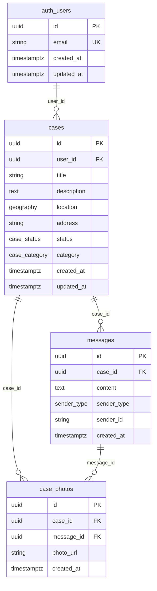

# 🗄️ Base de données - FixMyPidge

## Vue d'ensemble

FixMyPidge utilise **Supabase** comme Backend-as-a-Service, qui fournit une instance PostgreSQL 16 avec l'extension PostGIS pour les fonctionnalités géospatiales. L'architecture de données est conçue pour la sécurité, la performance et la scalabilité.

## 🏗️ Architecture de données

### Stack technique
- **PostgreSQL 16** : Base de données relationnelle
- **PostGIS** : Extension géospatiale pour localisation
- **Supabase Auth** : Gestion utilisateurs et authentification
- **Row Level Security (RLS)** : Isolation données par utilisateur
- **Supabase Storage** : Stockage objet pour photos

## 📊 Schéma de base de données

### Diagramme relationnel


## 📋 Tables détaillées

### auth.users (Supabase Auth)
Gestion automatique par Supabase Auth - utilisateurs et sessions.

```sql
-- Table gérée automatiquement par Supabase
auth.users (
  id                 UUID PRIMARY KEY DEFAULT gen_random_uuid(),
  email              TEXT UNIQUE NOT NULL,
  encrypted_password TEXT,
  email_confirmed_at TIMESTAMPTZ,
  created_at         TIMESTAMPTZ DEFAULT NOW(),
  updated_at         TIMESTAMPTZ DEFAULT NOW()
)

-- Index automatiques
CREATE UNIQUE INDEX users_email_idx ON auth.users(email);
CREATE INDEX users_created_at_idx ON auth.users(created_at);
```

### public.cases
Table principale des signalements de pigeons.

```sql
CREATE TABLE cases (
  id          UUID PRIMARY KEY DEFAULT gen_random_uuid(),
  user_id     UUID REFERENCES auth.users(id) ON DELETE CASCADE,
  title       TEXT NOT NULL,
  description TEXT,
  location    GEOGRAPHY(POINT), -- PostGIS: SRID 4326 (WGS84)
  address     TEXT,
  status      case_status DEFAULT 'nouveau',
  category    case_category,
  created_at  TIMESTAMPTZ DEFAULT NOW(),
  updated_at  TIMESTAMPTZ DEFAULT NOW()
);

-- Index pour performance
CREATE INDEX idx_cases_user_id ON cases(user_id);
CREATE INDEX idx_cases_status ON cases(status);
CREATE INDEX idx_cases_created_at ON cases(created_at DESC);
CREATE INDEX idx_cases_location ON cases USING GIST(location); -- Spatial index

-- Trigger pour updated_at automatique
CREATE TRIGGER update_cases_updated_at 
  BEFORE UPDATE ON cases 
  FOR EACH ROW 
  EXECUTE FUNCTION update_updated_at_column();
```

#### Contraintes et validations
```sql
-- Validation titre non vide
ALTER TABLE cases ADD CONSTRAINT cases_title_not_empty 
  CHECK (length(trim(title)) > 0);

-- Validation coordonnées géographiques (approximativement Belgique élargie)
ALTER TABLE cases ADD CONSTRAINT cases_location_bounds
  CHECK (
    location IS NULL OR (
      ST_X(location::geometry) BETWEEN 2.0 AND 7.0 AND
      ST_Y(location::geometry) BETWEEN 49.0 AND 52.0
    )
  );
```

### public.messages
Conversation entre utilisateurs et experts.

```sql
CREATE TABLE messages (
  id          UUID PRIMARY KEY DEFAULT gen_random_uuid(),
  case_id     UUID REFERENCES cases(id) ON DELETE CASCADE,
  content     TEXT NOT NULL,
  sender_type sender_type NOT NULL,
  sender_id   TEXT, -- ID expert ou NULL pour utilisateur
  created_at  TIMESTAMPTZ DEFAULT NOW()
);

-- Index pour performance
CREATE INDEX idx_messages_case_id ON messages(case_id);
CREATE INDEX idx_messages_created_at ON messages(created_at DESC);
CREATE INDEX idx_messages_sender_type ON messages(sender_type);

-- Contraintes
ALTER TABLE messages ADD CONSTRAINT messages_content_not_empty
  CHECK (length(trim(content)) > 0);
```

### public.case_photos
Photos attachées aux signalements ou messages.

```sql
CREATE TABLE case_photos (
  id         UUID PRIMARY KEY DEFAULT gen_random_uuid(),
  case_id    UUID REFERENCES cases(id) ON DELETE CASCADE,
  message_id UUID REFERENCES messages(id) ON DELETE SET NULL,
  photo_url  TEXT NOT NULL,
  created_at TIMESTAMPTZ DEFAULT NOW()
);

-- Index
CREATE INDEX idx_case_photos_case_id ON case_photos(case_id);
CREATE INDEX idx_case_photos_message_id ON case_photos(message_id);

-- Contraintes
ALTER TABLE case_photos ADD CONSTRAINT photos_valid_url
  CHECK (photo_url ~ '^https?://.*\.(jpg|jpeg|png|gif|webp)(\?.*)?$');
```

## 🏷️ Types personnalisés

### Énumérations
```sql
-- Statuts des signalements
CREATE TYPE case_status AS ENUM (
  'nouveau',              -- Signalement créé, en attente
  'en_cours',            -- Pris en charge par un expert
  'repondu',             -- Expert a fourni des conseils
  'resolu',              -- Situation résolue avec succès
  'ferme'                -- Dossier fermé définitivement
);

-- Catégories de signalements
CREATE TYPE case_category AS ENUM (
  'blessure_aile',        -- Blessure à l'aile
  'blessure_patte',       -- Blessure à la patte
  'emmele',               -- Emmêlé dans fils/filets
  'comportement_anormal', -- Comportement anormal observé
  'oisillon',             -- Oisillon trouvé
  'autre'                 -- Autre situation
);

-- Types de messages
CREATE TYPE sender_type AS ENUM (
  'user',    -- Message du citoyen utilisateur
  'expert'   -- Message d'un expert via n8n/Telegram
);
```

## 🔐 Sécurité - Row Level Security (RLS)

### Principe
Chaque utilisateur ne peut accéder qu'à ses propres données, appliqué automatiquement au niveau SQL.

### Policies pour cases
```sql
-- Activation RLS
ALTER TABLE cases ENABLE ROW LEVEL SECURITY;

-- Lecture : utilisateur ne voit que ses signalements
CREATE POLICY "users_view_own_cases" ON cases
  FOR SELECT USING (auth.uid() = user_id);

-- Création : utilisateur ne peut créer que pour lui-même
CREATE POLICY "users_create_own_cases" ON cases
  FOR INSERT WITH CHECK (auth.uid() = user_id);

-- Modification : utilisateur ne peut modifier que ses signalements
CREATE POLICY "users_update_own_cases" ON cases
  FOR UPDATE USING (auth.uid() = user_id);

-- Pas de suppression directe (soft delete via status si nécessaire)
```

### Policies pour messages
```sql
ALTER TABLE messages ENABLE ROW LEVEL SECURITY;

-- Lecture : messages des signalements de l'utilisateur
CREATE POLICY "users_view_case_messages" ON messages
  FOR SELECT USING (
    EXISTS (
      SELECT 1 FROM cases 
      WHERE cases.id = messages.case_id 
      AND cases.user_id = auth.uid()
    )
  );

-- Création : messages sur signalements de l'utilisateur
CREATE POLICY "users_create_case_messages" ON messages
  FOR INSERT WITH CHECK (
    EXISTS (
      SELECT 1 FROM cases 
      WHERE cases.id = messages.case_id 
      AND cases.user_id = auth.uid()
    )
  );
```

### Policies pour case_photos
```sql
ALTER TABLE case_photos ENABLE ROW LEVEL SECURITY;

-- Lecture : photos des signalements de l'utilisateur
CREATE POLICY "users_view_case_photos" ON case_photos
  FOR SELECT USING (
    EXISTS (
      SELECT 1 FROM cases 
      WHERE cases.id = case_photos.case_id 
      AND cases.user_id = auth.uid()
    )
  );

-- Création : photos sur signalements de l'utilisateur
CREATE POLICY "users_create_case_photos" ON case_photos
  FOR INSERT WITH CHECK (
    EXISTS (
      SELECT 1 FROM cases 
      WHERE cases.id = case_photos.case_id 
      AND cases.user_id = auth.uid()
    )
  );
```

## 🌍 Fonctionnalités géospatiales

### Configuration PostGIS
```sql
-- Extension PostGIS activée
CREATE EXTENSION IF NOT EXISTS "postgis";

-- Vérification version
SELECT PostGIS_Version();
```

### Utilisation des coordonnées
```sql
-- Insertion avec coordonnées (longitude, latitude)
INSERT INTO cases (user_id, title, location, address) VALUES (
  auth.uid(),
  'Pigeon blessé',
  ST_Point(4.3572, 50.8476), -- Longitude, Latitude (Bruxelles)
  'Place Eugène Flagey, Bruxelles'
);

-- Requête par distance (future fonctionnalité)
SELECT 
  id, title, address,
  ST_Distance(location, ST_Point(4.3572, 50.8476)) AS distance_meters
FROM cases 
WHERE ST_DWithin(location, ST_Point(4.3572, 50.8476), 1000) -- Rayon 1km
ORDER BY distance_meters;

-- Extraction coordonnées pour affichage
SELECT 
  id, title,
  ST_X(location::geometry) AS longitude,
  ST_Y(location::geometry) AS latitude
FROM cases 
WHERE location IS NOT NULL;
```

## 💾 Storage - Gestion des photos

### Configuration Supabase Storage
```sql
-- Bucket pour photos de signalements
INSERT INTO storage.buckets (id, name, public) 
VALUES ('case-photos', 'case-photos', true);

-- Policies Storage
CREATE POLICY "users_upload_case_photos" ON storage.objects
  FOR INSERT WITH CHECK (
    bucket_id = 'case-photos' 
    AND auth.uid()::text = (storage.foldername(name))[1]
  );

CREATE POLICY "public_read_case_photos" ON storage.objects
  FOR SELECT USING (bucket_id = 'case-photos');
```

### Structure des fichiers
```
case-photos/
├── {user_id}/
│   ├── {case_id}/
│   │   ├── {timestamp}-{filename}.jpg
│   │   ├── {timestamp}-{filename}.png
│   │   └── ...
│   └── ...
└── ...
```

## 📈 Optimisations et performance

### Index stratégiques
```sql
-- Requêtes fréquentes optimisées
CREATE INDEX CONCURRENTLY idx_cases_user_status 
  ON cases(user_id, status);

CREATE INDEX CONCURRENTLY idx_messages_case_created 
  ON messages(case_id, created_at DESC);

CREATE INDEX CONCURRENTLY idx_cases_created_status 
  ON cases(created_at DESC, status) 
  WHERE status IN ('nouveau', 'en_cours');
```

### Statistiques et monitoring
```sql
-- Vue pour statistiques (future)
CREATE VIEW case_statistics AS
SELECT 
  DATE_TRUNC('day', created_at) AS day,
  status,
  category,
  COUNT(*) AS count
FROM cases 
GROUP BY 1, 2, 3
ORDER BY 1 DESC;

-- Fonction pour métriques performance
CREATE OR REPLACE FUNCTION get_response_time_stats()
RETURNS TABLE(avg_hours DECIMAL, median_hours DECIMAL) AS $$
BEGIN
  RETURN QUERY
  SELECT 
    AVG(EXTRACT(EPOCH FROM first_response.created_at - c.created_at) / 3600) AS avg_hours,
    PERCENTILE_CONT(0.5) WITHIN GROUP (
      ORDER BY EXTRACT(EPOCH FROM first_response.created_at - c.created_at) / 3600
    ) AS median_hours
  FROM cases c
  JOIN LATERAL (
    SELECT created_at 
    FROM messages 
    WHERE case_id = c.id AND sender_type = 'expert'
    ORDER BY created_at 
    LIMIT 1
  ) first_response ON true
  WHERE c.status != 'nouveau';
END;
$$ LANGUAGE plpgsql;
```

## 🔧 Fonctions utilitaires

### Triggers automatiques
```sql
-- Mise à jour automatique updated_at
CREATE OR REPLACE FUNCTION update_updated_at_column()
RETURNS TRIGGER AS $$
BEGIN
  NEW.updated_at = NOW();
  RETURN NEW;
END;
$$ LANGUAGE plpgsql;

-- Application sur table cases
CREATE TRIGGER update_cases_updated_at 
  BEFORE UPDATE ON cases 
  FOR EACH ROW 
  EXECUTE FUNCTION update_updated_at_column();
```

### Fonctions métier
```sql
-- Fonction pour compter messages non lus (future)
CREATE OR REPLACE FUNCTION count_unread_messages(case_id UUID, user_id UUID)
RETURNS INTEGER AS $$
BEGIN
  -- Logique de comptage des messages non lus
  -- (nécessite table user_read_status pour implémentation complète)
  RETURN 0;
END;
$$ LANGUAGE plpgsql SECURITY DEFINER;
```

## 📊 Migration et versioning

### Script de migration initial
```sql
-- Version 1.0.0 - Schema initial
-- Fichier: supabase/migrations/20250906_001_initial_schema.sql

-- 1. Extensions
CREATE EXTENSION IF NOT EXISTS "postgis";

-- 2. Types personnalisés
CREATE TYPE case_status AS ENUM (...);
CREATE TYPE case_category AS ENUM (...);
CREATE TYPE sender_type AS ENUM (...);

-- 3. Tables
CREATE TABLE cases (...);
CREATE TABLE messages (...);
CREATE TABLE case_photos (...);

-- 4. Index et contraintes
CREATE INDEX idx_cases_user_id ON cases(user_id);
-- ... autres index

-- 5. RLS et policies
ALTER TABLE cases ENABLE ROW LEVEL SECURITY;
CREATE POLICY "users_view_own_cases" ON cases ...;
-- ... autres policies

-- 6. Storage
INSERT INTO storage.buckets ...;
CREATE POLICY "users_upload_case_photos" ...;
-- ... autres policies storage
```

### Migrations futures
```sql
-- Version 1.1.0 - Exemple d'évolution
-- Ajout d'un champ priority aux signalements
ALTER TABLE cases ADD COLUMN priority INTEGER DEFAULT 1;
CREATE INDEX idx_cases_priority ON cases(priority, created_at DESC);

-- Version 1.2.0 - Exemple d'évolution
-- Table pour tracking des lectures de messages
CREATE TABLE message_read_status (
  id UUID PRIMARY KEY DEFAULT gen_random_uuid(),
  user_id UUID REFERENCES auth.users(id),
  message_id UUID REFERENCES messages(id),
  read_at TIMESTAMPTZ DEFAULT NOW(),
  UNIQUE(user_id, message_id)
);
```

## 🛠️ Maintenance et monitoring

### Commandes d'administration
```sql
-- Statistiques tables
SELECT 
  schemaname, tablename, 
  n_tup_ins as inserts,
  n_tup_upd as updates, 
  n_tup_del as deletes
FROM pg_stat_user_tables
WHERE schemaname = 'public';

-- Taille des tables
SELECT 
  tablename,
  pg_size_pretty(pg_total_relation_size(schemaname||'.'||tablename)) as size
FROM pg_tables 
WHERE schemaname = 'public'
ORDER BY pg_total_relation_size(schemaname||'.'||tablename) DESC;

-- Index non utilisés
SELECT 
  schemaname, tablename, indexname, idx_scan
FROM pg_stat_user_indexes 
WHERE idx_scan = 0 AND schemaname = 'public';
```

### Backup et recovery
```bash
# Backup complet (à automatiser)
pg_dump -h localhost -U postgres -d fixmypidge -f backup.sql

# Backup schema uniquement
pg_dump -h localhost -U postgres -d fixmypidge -s -f schema.sql

# Restauration
psql -h localhost -U postgres -d fixmypidge -f backup.sql
```

---

## 🔄 Roadmap base de données

### Phase 2 - Optimisations
- **Partitioning** : Table messages partitionnée par date
- **Materialized Views** : Statistiques pré-calculées
- **Full-text search** : Recherche dans descriptions/messages
- **Audit log** : Traçabilité des modifications

### Phase 3 - Fonctionnalités avancées
- **Multi-tenant** : Support organisations multiples
- **Géofencing** : Alertes par zones géographiques
- **Time-series data** : Métriques de performance détaillées
- **Machine learning** : Classification automatique signalements

---

*Cette documentation évolue avec le schéma de base de données*